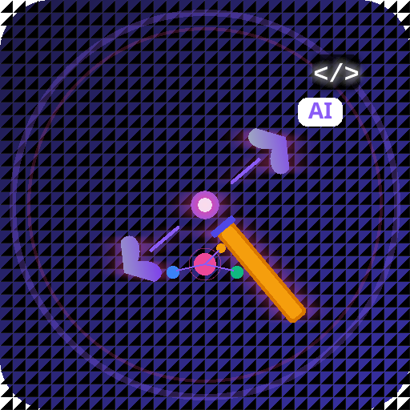
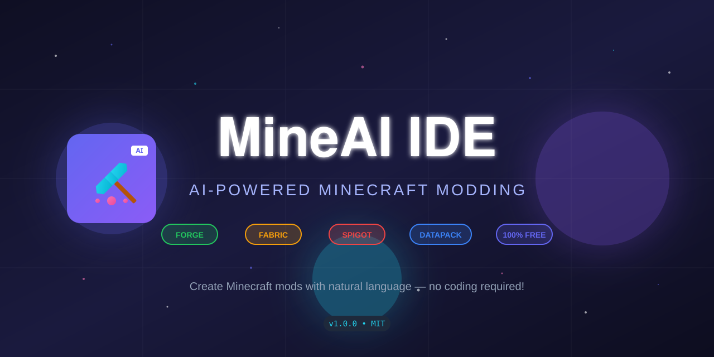
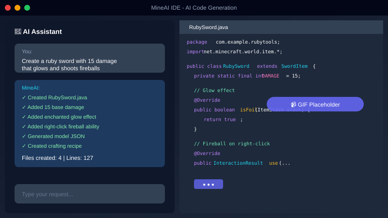
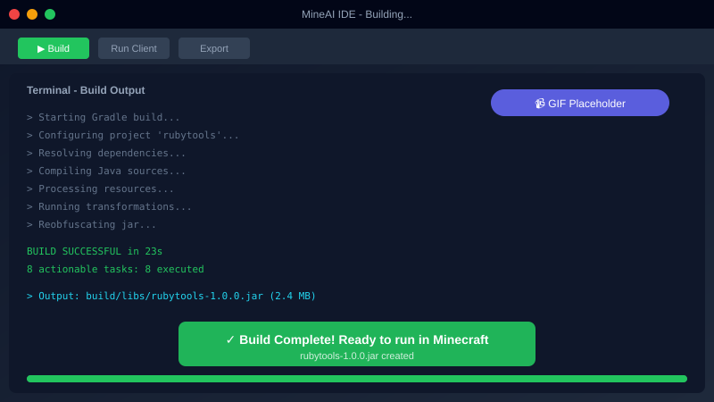
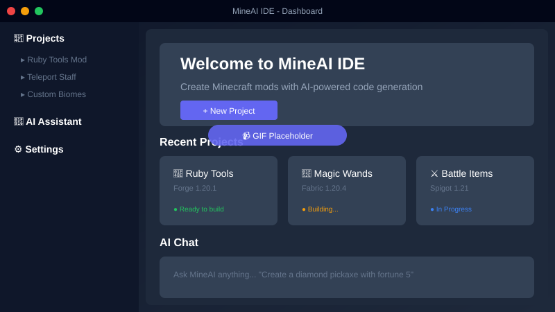
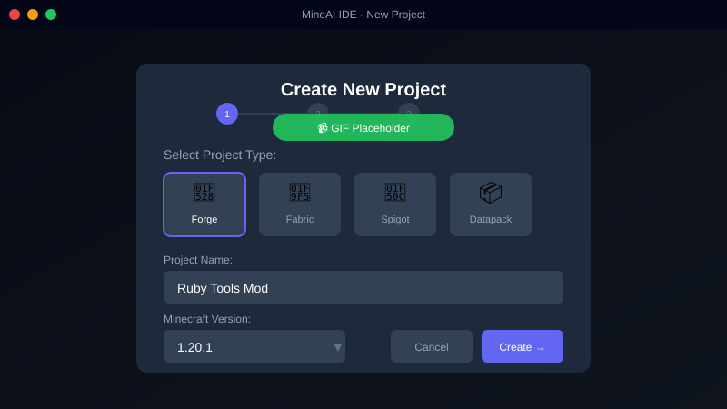

<div align="center">

#  MineAI IDE

### The AI-Powered Minecraft Development Environment



[](https://github.com/WayaSteurbautYT/MineAiIde/releases/latest)
[](LICENSE)
[](https://github.com/WayaSteurbautYT/MineAiIde/stargazers)
[](https://discord.gg/mineai)

**Create Minecraft mods, plugins, and datapacks by describing what you want.  
No coding experience required!**

[⬇️ Quick Install](#-quick-install) • [🎬 Watch Demo](#-demo) • [📖 Docs](#-documentation) • [💎 Examples](#-example-mod)

---

</div>

## 🚀 Quick Install

### Windows (One-Click)

```powershell
# Run in PowerShell (Admin)
winget install MineAI.IDE
```

**Or download the installer:**

| Installer | Size | Notes |
|-----------|------|-------|
| [📦 **MineAI-IDE-Setup.exe**](https://github.com/WayaSteurbautYT/MineAiIde/releases/latest/download/mineai-ide-1.0.0-x64-setup.exe) | ~150MB | Recommended - Full installer |
| [📁 **MineAI-IDE-Portable.exe**](https://github.com/WayaSteurbautYT/MineAiIde/releases/latest/download/mineai-ide-1.0.0.exe) | ~150MB | No install required |

> **Requirements:** Windows 10/11 64-bit, 8GB RAM recommended

---

## 🎬 Demo

<!-- TODO: Replace with actual recorded GIFs -->

### 💬 Describe → 🔨 Generate → ▶️ Play

<table>
<tr>
<td width="50%">

**Step 1: Tell AI What You Want**



*"Create a ruby sword that deals 15 damage and shoots fireballs on right-click"*

</td>
<td width="50%">

**Step 2: Build & Run**



*One click to compile → One click to play*

</td>
</tr>
</table>

### 🎨 Full IDE Experience

<div align="center">



*Project Dashboard with AI Assistant, File Explorer, and Terminal*

</div>

---

## ✨ Why MineAI IDE?

<table>
<tr>
<td align="center" width="25%">
<h3>🤖</h3>
<h4>AI-Powered</h4>
Describe in plain English.<br>AI writes the code.
</td>
<td align="center" width="25%">
<h3>📦</h3>
<h4>All Platforms</h4>
Forge, Fabric, Spigot,<br>Paper, Datapacks
</td>
<td align="center" width="25%">
<h3>⚡</h3>
<h4>One-Click Build</h4>
From idea to playable<br>mod in minutes
</td>
<td align="center" width="25%">
<h3>🆓</h3>
<h4>100% Free</h4>
Open source, MIT license,<br>no hidden costs
</td>
</tr>
</table>

### Supported Project Types

| Type | Versions | Status |
|------|----------|--------|
| **Forge Mod** | 1.12.2 - 1.21 | ✅ Full Support |
| **Fabric Mod** | 1.14 - 1.21 | ✅ Full Support |
| **NeoForge Mod** | 1.20.1 - 1.21 | ✅ Full Support |
| **Spigot Plugin** | 1.8.8 - 1.21 | ✅ Full Support |
| **Paper Plugin** | 1.19.4 - 1.21 | ✅ Full Support |
| **Datapack** | 1.13 - 1.21 | ✅ Full Support |
| **Resource Pack** | All | ✅ Full Support |
| **Modpack** | All | 🚧 Coming Soon |

---

## 💎 Example Mod

This mod was created with **one AI prompt** in MineAI IDE:

```
Create a ruby tools mod with a ruby sword (12 damage, glows red), 
ruby pickaxe (faster than diamond), ruby ore (spawns Y 5-20), 
and crafting recipes for all items.
```

**Result: [Ruby Tools Mod](examples/ruby-tools-mod/)** — Full source code included!

<details>
<summary><b>📜 See the generated code</b></summary>

```java
// Ruby Sword - Auto-generated by MineAI
public static final RegistryObject<Item> RUBY_SWORD = ITEMS.register(
    "ruby_sword",
    () -> new SwordItem(RUBY_TIER, 7, -2.4f, new Item.Properties()) {
        @Override
        public boolean isFoil(ItemStack stack) {
            return true; // Glow effect
        }
    }
);
```

</details>

---

## 🛠️ Getting Started

### 1️⃣ Create a Project



1. Click **"New Project"**
2. Choose **Forge**, **Fabric**, **Spigot**, or other
3. Enter your mod name
4. Select Minecraft version
5. Click **Create** — Done!

### 2️⃣ Add Content with AI

Open the AI chat and describe what you want:

```
✨ "Add a teleportation staff that teleports the player 50 blocks in the direction they're looking"

✨ "Create a custom enchantment called 'Vampiric' that heals the player when attacking"

✨ "Make a new dimension with floating islands and custom sky color"
```

### 3️⃣ Build & Test

- **`Ctrl+B`** — Build your mod
- **`F5`** — Run Minecraft with your mod
- **`Ctrl+Shift+B`** — Export final JAR

---

## 🤖 AI Options

MineAI works **online** or **offline** — your choice!

### ☁️ Cloud AI (Default)

Uses [OpenRouter](https://openrouter.ai) for powerful AI models:
- Google Gemini 2.0 Flash (free tier included)
- Claude 3.5 Sonnet
- GPT-4o

### 🖥️ Local AI (Offline)

Use [Ollama](https://ollama.ai) for 100% offline development:

```bash
# Install Ollama, then pull a model
ollama pull llama3.2
ollama pull codellama
```

In MineAI → Settings → Switch to "Local AI"

---

## 📖 Documentation

| Guide | Description |
|-------|-------------|
| **[🪟 Windows Build Guide](docs/build-windows.md)** | Build from source on Windows |
| **[🎬 Video Scripts](docs/video-scripts.md)** | Scripts for tutorial videos/GIFs |
| **[🧠 Minecraft Super IDE Plan](docs/minecraft-super-ide-plan.md)** | Cursor/Codex + MCreator-style roadmap |
| **[🚀 Getting Started](docs/getting-started.md)** | First steps with MineAI |
| **[💡 AI Commands](docs/ai-commands.md)** | Full list of AI prompts |
| **[📦 Project Types](docs/project-types.md)** | Forge vs Fabric vs Spigot |

---

## 🏗️ Building from Source

### Prerequisites

- Node.js 18+
- Python 3.10+ (for native modules)
- Visual Studio Build Tools (Windows)

### Quick Build

```bash
git clone https://github.com/WayaSteurbautYT/MineAiIde.git
cd MineAiIde
npm install
npm run build:win
```

Output: `release/mineai-ide-1.0.0-x64-setup.exe`

*See [Windows Build Guide](docs/build-windows.md) for detailed instructions.*

---

## 🗺️ Roadmap

### ✅ v1.0 — Current Release
- [x] AI code generation
- [x] Forge/Fabric/Spigot support
- [x] One-click build
- [x] Git integration
- [x] Windows release

### 🚧 v1.1 — In Progress
- [ ] 3D block/item model editor
- [ ] Texture painting tool
- [ ] Animation timeline (GeckoLib)
- [ ] Linux/Mac builds

### 📋 v1.2 — Planned
- [ ] Team collaboration
- [ ] Mod marketplace
- [ ] Plugin system
- [ ] Auto-updates

### 🔮 Super IDE Vision
- [ ] Cursor/Codex-style multi-agent coding experience
- [ ] Blockbench + GeckoLib in-IDE production workflow
- [ ] MCP-powered recommendations (Context7/Storm/custom servers)
- [ ] Free + paid AI routing (Ollama/OpenRouter) with budget controls

See **[Minecraft Super IDE Plan](docs/minecraft-super-ide-plan.md)** for the detailed architecture and phased backlog.

---

## 💬 Community

<table>
<tr>
<td align="center">
<a href="https://discord.gg/mineai">

<br><b>Join Discord</b>
</a>
</td>
<td align="center">
<a href="https://twitter.com/MineAI_IDE">

<br><b>Follow Updates</b>
</a>
</td>
<td align="center">
<a href="https://github.com/WayaSteurbautYT/MineAiIde/discussions">

<br><b>Discussions</b>
</a>
</td>
<td align="center">
<a href="https://www.youtube.com/@MineAI_IDE">

<br><b>Tutorials</b>
</a>
</td>
</tr>
</table>

---

## 🤝 Contributing

We welcome contributions! See our [Contributing Guide](CONTRIBUTING.md).

```bash
# Fork, clone, and start developing
git clone https://github.com/YOUR_USERNAME/MineAiIde.git
npm install
npm run dev
```

---

## ❓ FAQ

<details>
<summary><b>Is MineAI IDE really free?</b></summary>

Yes! MineAI IDE is 100% free and open source under the MIT license. The cloud AI has a free tier that's generous for most users. For unlimited use, get your own API key or use local AI (Ollama).

</details>

<details>
<summary><b>Do I need to know how to code?</b></summary>

No! That's the whole point. Just describe what you want in plain English, and MineAI generates the code. However, knowing basics of Minecraft modding concepts helps you give better prompts.

</details>

<details>
<summary><b>What Minecraft versions are supported?</b></summary>

We support Minecraft 1.12.2 through 1.21 for Forge/Fabric mods, 1.8.8 through 1.21 for Spigot/Paper plugins, and 1.13+ for datapacks.

</details>

<details>
<summary><b>Can I use my mods commercially?</b></summary>

Yes! Mods you create are yours. You can upload them to CurseForge, Modrinth, sell them, or do whatever you want.

</details>

---

## 📄 License

MIT License — see [LICENSE](LICENSE) for details.

---

## 🙏 Credits

Built with [Electron](https://electronjs.org), [React](https://reactjs.org), [Vite](https://vitejs.dev), [Tailwind CSS](https://tailwindcss.com), and powered by [OpenRouter](https://openrouter.ai) & [Ollama](https://ollama.ai).

Special thanks to the Minecraft modding community ❤️

---

<div align="center">

**Made with ❤️ for Minecraft Creators**

*"Every great mod starts with an idea. MineAI turns ideas into reality."*

⭐ **Star this repo** if MineAI helps you build something awesome!

<br>

[](https://github.com/WayaSteurbautYT/MineAiIde/releases/latest)

</div>
